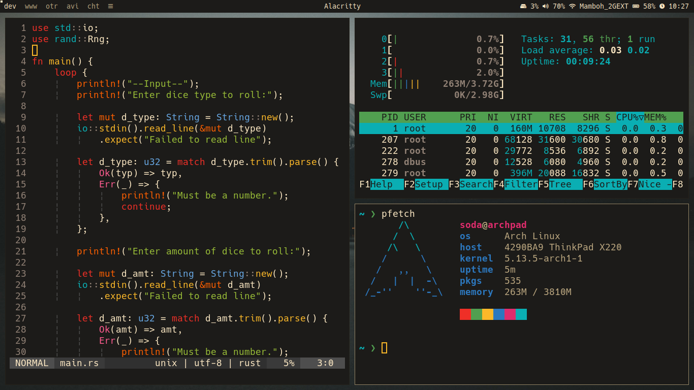

# thinpad-dotfiles

### Overview
These are my Lenovo Thinkpad X220's dotfiles

### Screenshot

### Included Dots
* dwm
* slstatus
* dmenu
* alacritty
* mpd
* bash
* vim
* starship prompt

### Recommended Fonts & Compositor
* Picom or one of it's forks is recommended!
* Fonts Used:
    * Hack Font
    * Awesome 5 (Icons)

### DWM Patches
* actualfullscreen
* alwayscenter
* attackbottom
* autostart
* bar-height
* centeredwindowname
* colorbar
* pertag
* resizecorners
* vanitygaps

### Installation
* Clone this repository
* Install software for desired dots
* Install Recommended Fonts & Vim-Plug
* Move dots to respective directories
    * Move .vimrc, .bashrc & .dwm to $HOME
    * alacritty & mpd folders go into $HOME/.config
    * starship.toml file goes into $HOME/.config
* Compile dwm, sltatus & dmenu
    * Make any desired changes (keybinds, colors, etc) to each config.h
    * cd into each directory & run `sudo make clean install`
* Done!
